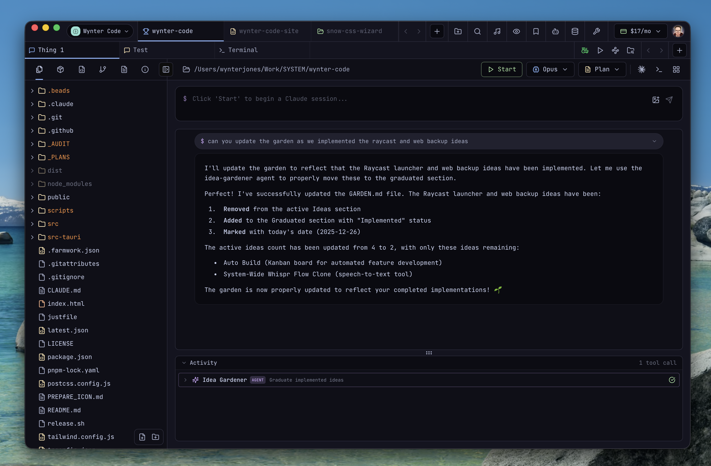

# Wynter Code

**The ultimate toolkit for developers who like their tools sharp, fast, and just a little bit magical.**

Built with Tauri 2.0, React 18, and TypeScript — wrapped in a VSCode-inspired dark theme with Catppuccin vibes.

---

## What's Inside

### Claude Code Integration

The heart of Wynter Code. A native desktop experience for Claude Code CLI with:

- **Multi-session support** — Run multiple Claude conversations side by side
- **Live Preview** — See your changes render in real-time
- **Response carousel** — Browse through Claude's responses with ease
- **Git-aware file browser** — Send files and context directly to Claude
- **Integrated terminal** — Full xterm.js terminal built right in

---

### Dev Toolkit — 32 Tools

Everything you need, one click away.

| Category | Tools |
|----------|-------|
| **Encoding** | Base64, URL Encode/Decode, HTML Entities, String Escape |
| **Data Formats** | JSON Formatter, JSON ↔ YAML, CSV ↔ JSON Converter |
| **Crypto** | Hash Generator, HMAC, Bcrypt, Password Generator |
| **Parsing** | JWT Debugger, URL Parser, Regex Tester, Cron Parser |
| **Text** | Lorem Ipsum, Case Converter, Slug Generator, Word Counter, Text Diff, List Sorter |
| **Generators** | UUID, QR Code, Timestamps, Number Base Converter, Placeholder Images |
| **Reference** | HTTP Status Codes, User Agent Parser, IP Address Tool, Byte Size Converter |
| **Validation** | HTML/CSS Validator, EXIF Remover |

---

### Domain Tools — 11 Tools

For when you need to know what's happening on the web.

| Category | Tools |
|----------|-------|
| **Domain** | WHOIS Lookup, Domain Availability Checker |
| **DNS** | DNS Lookup, DNS Propagation Checker |
| **Security** | SSL Certificate Inspector, HTTP Headers Analyzer |
| **Network** | IP Geolocation, Redirect Chain Tracker |
| **SEO** | Dead Link Checker, Lighthouse Auditor |
| **Utilities** | Favicon Grabber |

---

### SEO Tools — 9 Tools

Everything for search engine optimization.

| Category | Tools |
|----------|-------|
| **Meta** | Meta Tags Generator, Canonical URL Helper |
| **Social** | Open Graph Generator, Twitter Card Generator |
| **Technical** | JSON-LD / Structured Data Generator, Robots.txt Generator |
| **Sitemap** | XML Sitemap Generator, Hreflang Generator |
| **AI** | LLMs.txt Generator |

---

### Recording & Media

Create content without leaving your IDE.

- **Floating Webcam** — Desktop-pinned overlay with customizable borders, effects, and shadows
- **Decart AI Integration** — Real-time AI effects for your webcam
- **Screen Studio** — Cinematic screen recorder with zoom effects
- **GIF Recorder** — Record screen regions directly to GIF

---

### Infrastructure Tools

Keep your local dev environment under control.

- **Port Manager** — See what's running where
- **Localhost Tunnel** — Share your local server with the world
- **Background Services** — Monitor what's happening behind the scenes
- **System Health** — Keep an eye on CPU, memory, and disk
- **Homebrew Manager** — Install, update, and manage Homebrew packages and casks
- **System Cleaner** — Find large files, clear app caches, manage installed apps
- **Overwatch** — Production service monitoring dashboard

---

### Deployment & Backup

Ship it and keep it safe.

- **Netlify FTP** — Deploy with a retro FTP-style experience
- **Web Backup** — Encrypted cloud backup settings

---

### Utilities

The little things that make life easier.

- **Node Modules Cleaner** — Reclaim your disk space
- **Environment Variables** — Manage .env files and secrets
- **MCP Servers** — Manage Model Context Protocol servers
- **Favicon Generator** — Create favicons from any image
- **Database Viewer** — Browse SQLite, PostgreSQL, and MySQL
- **Just Command Manager** — Run justfile recipes with a nice UI

---

### Development Tools

For building and testing your apps.

- **Test Runner** — Run your test suites with visual results
- **Storybook Viewer** — Browse your component library
- **API Tester** — Send requests, inspect responses, manage webhooks
- **Beads Tracker** — Issue tracking with Kanban board
- **Claude Code Stats** — Usage analytics and insights
- **Claude Code Limits** — Monitor API usage limits and reset times
- **Farmwork Tycoon** — A little game that tracks your CLI activity

---

### Project Tools

Manage your codebase.

- **New Project** — Create from templates (React, Next.js, Tauri, etc.)
- **File Finder** — Browse and open project files
- **Project Search** — Search and replace across files
- **Auto Build** — Automated issue processing with Claude
- **Farmwork** — Dev workflow auditing and automation

---

### Productivity

Stay focused and organized.

- **Music / Meditation** — Ambient soundscapes with planetary themes and internet radio
- **Bookmarks** — Quick access to your favorite links
- **Subscription Manager** — Track your SaaS subscriptions and costs

---

### File Management

View and edit anything.

- **File Browser** — Git-aware with status indicators
- **Quick Look** — Preview files without opening them
- **PDF Viewer** — Read PDFs inline
- **Image Viewer** — View images with zoom and pan
- **Video Player** — Watch videos without leaving the app
- **Audio Player** — Play audio files
- **Font Viewer** — Preview font families
- **Markdown Editor** — Write and preview markdown
- **Code Editor** — Monaco-powered editing

---

### Core Features

The foundation everything else is built on.

- **Multi-Panel Layouts** — Arrange your workspace however you like
- **Command Palette** — Quick access to everything (Ctrl/Cmd + P)
- **Lightcast Launcher** — Raycast-style global launcher
- **Git Integration** — Branches, commits, diffs, and sync
- **Drag & Drop** — Move files, panels, whatever you need
- **Keyboard Shortcuts** — Fully customizable
- **Settings** — Colors, keybindings, and preferences

---

## Built With

| | |
|---|---|
| **Desktop** | Tauri 2.0 (Rust + Web) |
| **Frontend** | React 18, TypeScript, Tailwind CSS |
| **Editor** | Monaco Editor |
| **Terminal** | Xterm.js |
| **State** | Zustand |
| **Database** | SQLx (SQLite, PostgreSQL, MySQL) |
| **Graphics** | Recharts, Pixi.js |
| **AI** | Claude Code CLI |

---

## License

This project is licensed under the [Polyform Noncommercial License 1.0.0](LICENSE).

You're free to view, fork, and modify this software for any noncommercial purpose. Commercial use requires explicit permission from the author.

---

## Acknowledgments

- [Tauri](https://tauri.app/) — Desktop app framework
- [Claude Code](https://claude.ai/code) — AI coding assistant
- [Catppuccin](https://catppuccin.com/) — Color palette inspiration
- [Lucide](https://lucide.dev/) — Icons

---

*"Work is love made visible.*

*And if you cannot work with love but only with distaste, it is better that you should leave your work and sit at the gate of the temple and take alms of those who work with joy."*

**— Kahlil Gibran, The Prophet**

